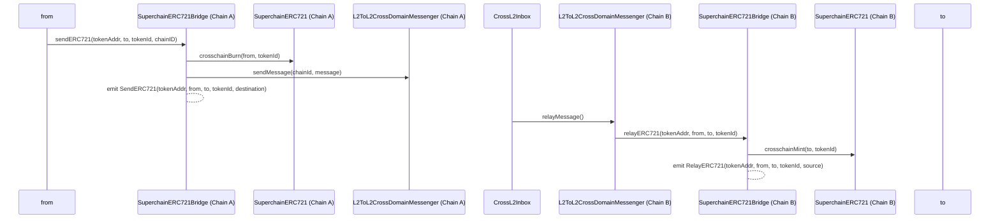

```mermaid
sequenceDiagram
  participant from
  participant L2SBA as SuperchainERC721Bridge (Chain A)
  participant SuperERC721_A as SuperchainERC721 (Chain A)
  participant Messenger_A as L2ToL2CrossDomainMessenger (Chain A)
  participant Inbox as CrossL2Inbox
  participant Messenger_B as L2ToL2CrossDomainMessenger (Chain B)
  participant L2SBB as SuperchainERC721Bridge (Chain B)
  participant SuperERC721_B as SuperchainERC721 (Chain B)
  participant Recipient as to

  from->>L2SBA: sendERC721(tokenAddr, to, tokenId, chainID)
  L2SBA->>SuperERC721_A: crosschainBurn(from, tokenId)
  L2SBA->>Messenger_A: sendMessage(chainId, message)
  L2SBA-->L2SBA: emit SendERC721(tokenAddr, from, to, tokenId, destination)
  Inbox->>Messenger_B: relayMessage()
  Messenger_B->>L2SBB: relayERC721(tokenAddr, from, to, tokenId)
  L2SBB->>SuperERC721_B: crosschainMint(to, tokenId)
  L2SBB-->L2SBB: emit RelayERC721(tokenAddr, from, to, tokenId, source)

```